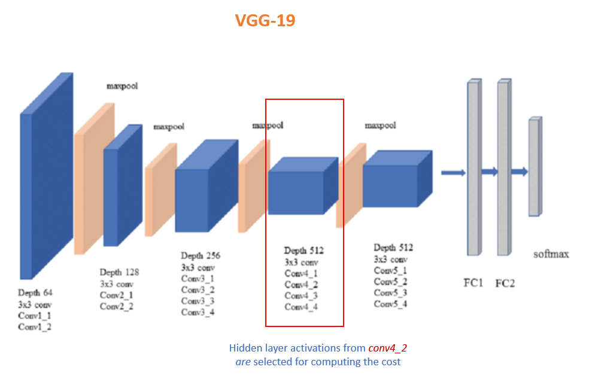

# Neural Style Transfer

Neural Style transfer is a techniques that uses deep learning to generate a new image that merges a content image (C) and a Style image(S)

<Insert a pic  C+ S = G>

This uses the concept of "Transfer learning" where a deep neural network trained for a different application can be used as a base network for traning a new application. The rationale is that a  pre-trained model on a very large dataset like ImageNet would have already learnt the high level (objects, patterns) and low level (edges, corners, shades) features that are essential for detecting  various objects in the new task.

This repository implements the original NST paper by [Gatys et al (2015)](https://arxiv.org/abs/1508.06576). Here we will use VGG-19 pre-trained network for this task. 

# Steps of algorithm

# Content cost 

The goal is we want the generated image (G) to look like the content image (C). So a particular hidden layer's activation output is chosen to represent the "Content" of an image. 

Steps to compute Content Cost:
1. Input C to the VGG-19 model, forward-propagate and get the content activation on layer $l$, $a^{(C)}$
2. Input G to the VGG-19 model, forward-propagate and get the content activation on layer $l$, $a^{(G)}$
3. Compute content cost using 

$$J_{content}(C,G) =  \frac{1}{4 \times n_H \times n_W \times n_C}\sum _{ \text{all entries}} (a^{(C)} - a^{(G)})^2\tag{1} $$

Where  $n_H$ -  height , $n_W$ - Width and $n_C$ - number of channels in the chosen hidden layer , $l$

### How to select layer $l$ for computing the cost ?

Eventhough $G$ is initialized with a noise image ($N$) in the beginning, usually it is also set to resemble a percentage of $C$ (Weighted average). A $Noise Ratio = 0.6$ is a good starting point

$$ G =  N \times Noise Ratio  +  C \times (1 - Noise Ratio)$$

* when $l$ is selected from shallow layers, $G$ will resemble $C$ too much
* when $l$ is selected from very deep layers, $G$ wil hardly have resemblance to $C$
* for "visually pleasing" results, $l$ is chosen somewhere in the **middle** layers of the model to have the right blend of $C$ in $G$

Here, the activations from hidden layer conv4_2 are selected for comparing $C$ with $G$

<figure>
    
    <figcaption>[VGG-19]https://miro.medium.com/max/2408/1*6U9FJ_se7SIuFKJRyPMHuA.png)</figcaption>
</figure>

# Style cost 

# examples of different combinations

## References

## Dependencies

Pretrained model VGG Network
http://www.vlfeat.org/matconvnet/models/beta16/imagenet-vgg-verydeep-19.mat

## Useful links: 

* only my reference*
https://github.com/anishathalye/neural-style/tree/75188f06cac8140143ee32c35d68e1484d5f6687 

