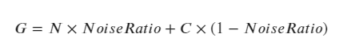
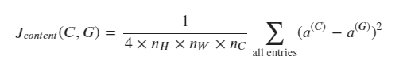
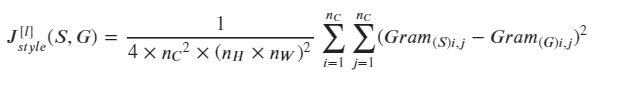
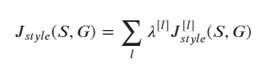
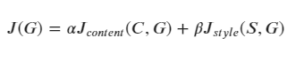

# Neural Style Transfer

Neural Style transfer is a techniques that uses deep learning to generate a new image that merges a content image (C) and a Style image(S)

<figure>
    
</figure>

Here is the animation of the generated image getting updated through the iterations 

<video controls preload autoplay loop>
	<source src="images/G_video.mp4" type="video/mp4" />
	Your browser does not support the video tag.
</video>

This uses the concept of "Transfer learning" where a deep neural network trained for a different application can be used as a base network for traning a new application. The rationale is that a  pre-trained model on a very large dataset like ImageNet would have already learnt the high level (objects, patterns) and low level (edges, corners, shades) features that are essential for detecting  various objects in the new task.

This repository implements the original NST paper by [Gatys et al (2015)](https://arxiv.org/abs/1508.06576). Here we will use VGG-19 pre-trained network for this task. 

### How to select layer ***l*** for computing the cost ?

Eventhough G is initialized with a noise image (N) in the beginning, usually it is also set to resemble a percentage of C (Weighted average). ***A Noise Ratio = 0.6*** is a good starting point

<figure>
    
</figure>

* when ***l*** is selected from shallow layers, G will resemble C too much
* when ***l*** is selected from very deep layers, G wil hardly have resemblance to C
* for "visually pleasing" results, ***l*** is chosen somewhere in the **middle** layers of the model to have the right blend of C in G

Here, the activations from hidden layer ***conv4_2*** are selected for comparing C with G

<figure>
    
    <figcaption><a href="https://miro.medium.com/max/2408/1*6U9FJ_se7SIuFKJRyPMHuA.png">VGG-19</a></figcaption>
</figure>

# NST Algorithm 

1. Create a tf Interactive Session
2. Initializations
- Select Content image
- Select Style image
- Initialize Generated image = Noise + Content image
3. Load the pre-trained VGG-19 model
4. Build the Tensorflow graph
- Compute content cost by passing C as input to the model
- Compute style cost from all layers, by passing S as input to the model
- Compute total cost
- define optimizer and learning rate
5. Initialize the Tensorflow graph and update the Generated image for every epoch

# Content Cost 

The goal is we want the generated image (G) to look like the content image (C). So a particular hidden layer's activation output is chosen to represent the "Content" of an image. 

Steps to compute Content Cost:
1. Input C to the VGG-19 model, forward-propagate and get the content activation on layer ***l, a(C)***
2. Input G to the VGG-19 model, forward-propagate and get the content activation on layer ***l, a(G)***
3. Compute content cost using 

<figure>
    
</figure>

Where  ***n_H*** -  height , ***n_W*** - Width and ***n_C*** - number of channels in the chosen hidden layer , ***l***

# Style Cost 

Style of an image is defined by how correlated are the activations between different layers of an image. The degree of correlation between features in a layer measures how similar or different their styles are. 

A **"Gram Matrix"**, also called a **Style Matrix**, computes the correlation of features in an activation and is given by ***G_A = A A^T***. 

Steps to compute the Style Cost:
1. Get ***a(S)*** on layer ***l*** and compute Gram matrix for Style image ***Gram_S***
2. Get ***a(G)*** on layer ***l*** and compute Gram matrix for Generated image ***Gram_G***
3. the style cost for layer ***l*** is defined to be the distance between the Gram matrices

<figure>
    
</figure>

4. Aggregate style cost over multiple layers

	Instead of comparing style from just one layer, using multiple layers will capture style from shallow layers (detailed features) as well as deeper layers (high level features). Each layer's contribution can be weighted by a factor lambda

<figure>
    
</figure>

# Total Cost 

The total cost function combines both the Content cost as well as the Style cost functions

<figure>
    
</figure>

# Execution instructions:

Download the pre-trained model VGG-19 from [here](http://www.vlfeat.org/matconvnet/models/beta16/imagenet-vgg-verydeep-19.mat) and paste it under folder "pretrained-model".

You can use -h to display the help section of the application (example: python nst_main.py -h)

**Basic usage** - `python nst_main.py`.  

**Options parameters**

* To use your own images, (requirement: (WIDTH = 400, HEIGHT = 300) copy the content and style images in folder "images" and use them as 
`python nst_main.py --content_image_filename louvre_small.jpg --style_image_filename style1.jpg`

* To change the number of iterations:
`python nst_main.py --epochs 200` 

* To print cost and save generated images for every iteration:
`python nst_main.py --print_every 20` 

* to set the learning rate for optimizer
`python nst_main.py --learning_rate 2.0` 

* to set the weights for content cost (alpha) and style cost (beta)
`python nst_main.py --alpha 10 --beta 40` 

Intermediate output images are saved in "output" folder

### References:

The Neural Style Transfer algorithm was due to Gatys et al. (2015). Harish Narayanan and Github user "log0" also have highly readable write-ups from which we drew inspiration. The pre-trained network used in this implementation is a VGG network, which is due to Simonyan and Zisserman (2015). Pre-trained weights were from the work of the MathConvNet team. 

- Leon A. Gatys, Alexander S. Ecker, Matthias Bethge, (2015). [A Neural Algorithm of Artistic Style](https://arxiv.org/abs/1508.06576) 
- Harish Narayanan, [Convolutional neural networks for artistic style transfer.](https://harishnarayanan.org/writing/artistic-style-transfer/)
- Log0, [TensorFlow Implementation of "A Neural Algorithm of Artistic Style".](http://www.chioka.in/tensorflow-implementation-neural-algorithm-of-artistic-style)
- Karen Simonyan and Andrew Zisserman (2015). [Very deep convolutional networks for large-scale image recognition](https://arxiv.org/pdf/1409.1556.pdf)
- [MatConvNet.](http://www.vlfeat.org/matconvnet/pretrained/)

This project was completed as part of "Convolutional Neural Networks" course by Coursera and deeplearning.ai (part of Deep Learning Specialization taught by Prof. Andrew Ng)
